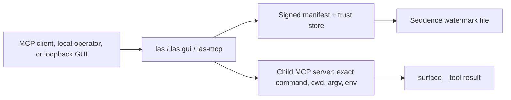

<!-- wisent-banner:start -->
<p align="center">
  
</p>
<!-- wisent-banner:end -->

<!-- wisent-readme-signals:start -->
[](https://github.com/wisent-ai/las) [](https://github.com/wisent-ai/las/issues) [](https://wisent.com) [](https://discord.gg/qRjpkthq54) [](https://www.linkedin.com/company/wisent-ai/) [](https://x.com/wisentai) [](https://calendly.com/lbartoszcze)
<!-- wisent-readme-signals:end -->

# Las: Every Tool Your AI Agents Need Through One MCP
Access All Incredible Tools from Wisent and Explore Their Synergies.

Includes:

- Weles (Undetectable Browser for Perfect AI Agent Internet Use)
- Skarbiec (Secrets and Authentication Management for the AI Agent Era)
- Tama (Never Get Frustrated by AI Again — Block the Behaviors You Don’t Want)
- Stado (The Easiest Harness for Managing Compute and Storage Across Local, GCP, AWS, and Azure Infrastructure)
- Lem (The AI Research and Conference Management Tool That Fully Automates Research)
- Most (The Easiest Way to Add iMessage and SMS to Your AI Agent Stack)
- Probierz (AI QA That Makes Sure You Never Ship Anything Broken)
- Brama (Keep All Your Models Accessible Through One Endpoint)
- Echo (AI GTM — Manage B2B Outreach, UGC, Meta Ads, and Google Ads from One Harness)
- Byk (Make Money with AI Trading)
- Warsztat (Repository Proposal Workflow)
- Finance (Financial Reference and Proposals)

**Las is the local catalogue and policy-preserving federation layer for Wisent
agent tools: it adopts operator-approved sibling MCP registrations, verifies
their signed release contracts, and exposes them through one stdio MCP server,
one CLI, and an on-demand loopback graphical importer.**

Las does not implement the child tools, broaden their permissions, broker raw
secrets, or make an unavailable child look healthy. A child remains responsible
for its own authorization and product behavior.

[Product documentation](https://las.wisent.com/docs) · [Quick start](#quick-start) · [Federated surfaces](#federated-surfaces) ·
[Signed release boundary](#signed-release-boundary) · [Canonical repository](https://github.com/wisent-ai/las)

Current boundary: public development source for Node.js 18+ under Apache-2.0.
Las expects a coordinated local Wisent workspace and operator-provisioned signed
release files. No stable package publication, hosted organization catalogue,
managed installation, or availability SLA is currently promised.

## Problem and intended users

A local coding agent can use multiple Wisent products—browser automation,
credential capabilities, compute status, research metadata, communications,
quality tooling, and proposal workflows—but registering every MCP server
individually creates collisions and inconsistent launch/security configuration.
Blindly aggregating whatever a child advertises would also turn local binary or
schema drift into an authority escalation.

Las serves:

- **local Wisent operators** who need one catalogue of configured agent surfaces;
- **coding-agent integrators** connecting a single stdio MCP endpoint instead of
  many sibling processes;
- **security and release operators** binding exact child commands, code/binary
  digests, environment names, tool names, schemas, and credential templates;
- **incident responders** checking which child starts, handshakes, and exposes the
  signed tool count without invoking its tools.

## Product boundaries

### Included

- `las` CLI for adopting existing local MCP configuration, registry listing,
  advertised-tool inventory, connectivity checks, and the durable `las gui`
  host;
- an accessible browser importer served by `las gui` from the installed package;
- `las-mcp` stdio JSON-RPC/MCP server;
- deterministic `<surface>__<tool>` namespacing;
- child process launch from a static repository-owned registry;
- Ed25519-verified, expiring, sequence-watermarked release manifests;
- exact binding of child command, working directory, argv, inherited environment
  names, binary digest, code digest, tool names, and input-schema digests;
- owner-only durable catalogue registrations imported from standard
  `mcpServers` or VS Code `servers` JSON;
- operator filters that can subtract surfaces through `LAS_ONLY` and `LAS_SKIP`;
- credential-template injection that model-supplied arguments cannot override;
- stricter local capability/output policy for the Skarbiec boundary;
- a separately configured proposal-only Finance boundary;
- cleanup of spawned children after stdin closes and in-flight requests settle.

### Explicit non-goals and limitations

- Las is not network or plugin discovery. The supported surface definitions and
  workspace paths remain compiled into source; local discovery only imports
  matching stdio registrations from established MCP client JSON.
- It does not install, build, configure, authenticate, or repair child products.
- It does not merge tool permissions. Routing through Las grants no permission
  beyond the signed/local policy and the child server's own checks.
- It is not a secret broker. Raw-secret environment inheritance is prohibited for
  ordinary signed surfaces; credential templates contain approved bounded values,
  not general secret discovery.
- It does not provide process isolation, sandboxing, network policy, resource
  quotas, or OS-user separation for children.
- A valid manifest proves authorization by a configured trust key and byte/schema
  binding. It does not prove that a child is safe, correct, bug-free, or free of
  malicious behavior.
- Federation tolerates an unavailable child by omitting its tools and logging only
  its static surface name. A partial catalogue is therefore possible.
- Child requests have no Las-imposed timeout. A child that never responds can
  keep the corresponding operation in flight until the process exits or is
  externally interrupted.
- The MCP server supports initialize, ping, tools/list, and tools/call—not the
  entire MCP protocol surface.
- The first federation result is memoized for one Las process; child changes are
  not hot-reloaded.
- Standalone clone layout is insufficient for normal use. Las resolves sibling
  products from the parent Wisent workspace.

## Federated surfaces

The current source registry knows these surfaces:

| Las name | Owning surface | Registry posture |
|---|---|---|
| `weles` | Weles browser executor MCP | signed release required |
| `skarbiec` | capability broker MCP | signed release plus strict local schema/taxonomy/result validation |
| `tama` | local hook catalogue/inspection MCP | signed release; explicit read-oriented tool allowlist |
| `stado` | compute status/cost/quota/schedule MCP | signed release required |
| `lem` | research registry/provenance MCP | signed release required |
| `echo` | growth/content dashboard MCP | signed release required |
| `most` | communications health/diagnostics MCP | signed release required |
| `probierz` | cross-platform quality MCP | signed release required |
| `byk` | founder-strategy/Oko MCP | signed release required |
| `brama` | model gateway detect/list MCP | signed release required |
| `warsztat` | repository proposal workflow MCP | signed release and explicit proposal-tool allowlist |
| `finance` | financial reference/proposal MCP | separate local policy and exact configuration required |

Descriptions are operator hints, not authorization contracts. The signed manifest,
local special policy, advertised schema verification, argument policy, and child
server enforcement determine the callable surface.

## Core use cases

### List the local catalogue

- **Actor:** a local operator.
- **Initial state:** Las can evaluate its signed release/configuration files.
- **Outcome:** JSON reports every known surface with its registration source,
  static summary, and `configured` and `active` booleans.
- **Boundary:** `las list` does not spawn children, write state, or prove connectivity.


### Check child connectivity

- **Actor:** an operator diagnosing setup.
- **Initial state:** selected surfaces are active and their exact approved
  commands/builds exist.
- **Outcome:** Las spawns each child, initializes MCP, verifies `tools/list`,
  reports tool count, then closes it.
- **Boundary:** the check invokes no child tool and does not prove downstream
  credentials/data/providers are healthy.

### Expose one MCP endpoint

- **Actor:** a local coding agent with an approved identity/configuration.
- **Initial state:** an MCP client initializes Las, including the required agent ID
  when Skarbiec is active.
- **Outcome:** signed child tools appear as `surface__tool`; calls route to the
  owning child after policy-controlled argument injection/validation.
- **Boundary:** failures return generic Las errors; child-controlled diagnostics
  are intentionally not forwarded into the parent protocol stream.

## How it works

Las normally runs as one local CLI or stdio MCP process. `las gui` instead starts
an explicit loopback-only HTTP workspace for catalogue adoption; it does not
open a browser. All three surfaces share the static registry compiled into
`src/registry.mjs`. Federation resolves every child from the parent Wisent
workspace, admits a surface only when its signed release entry verifies, then
spawns that child's own MCP server over stdio and proxies JSON-RPC to it. Tool
names are namespaced on the way out; arguments and results are policed on the way
in and back. Las adds no child capability of its own.



- **Durable state:** the owner-only catalogue contains adopted registrations;
  the sequence watermark named by `LAS_RELEASE_WATERMARK_FILE` advances only to a
  higher manifest sequence through an owner-only temporary file, `fsync`, and an
  atomic rename; first-use progress is stored under the user's state directory.
  Browser-uploaded sources are retained owner-only under
  `${XDG_STATE_HOME:-~/.local/state}/las/gui-imports/` so the catalogue's source
  path remains real and inspectable. The manifest, detached signature, trust
  store, and child policy files remain operator-owned inputs. Child product data
  stays with the child.
- **Credential boundary:** Las never inherits the parent environment. Each child
  receives a frozen environment built from a fixed system `PATH` plus only the
  variable names in that surface's allowlist, which must equal the signed
  `env_names` list. Names matching `TOKEN`, `SECRET`, `PASSWORD`, `UNLOCK`,
  `PRIVATE_KEY`, or `SIGNING_KEY` are rejected for ordinary surfaces. The trust
  store holds public verification keys only; no signing key belongs in this
  workspace. Signed credential templates are fixed arguments that model-supplied
  arguments cannot overwrite, and the Skarbiec boundary returns availability or
  opaque capability IDs rather than redeemed credentials.
- **Network boundary:** ordinary CLI commands and `las-mcp` open no listening
  socket. `las gui` binds `127.0.0.1` only for its process lifetime, prints the
  exact tokenized URL, and never opens a browser. The host rejects mismatched
  `Host` headers, requires the per-session bearer token for API reads and writes,
  requires the exact session `Origin` for adoption, and caps request bodies
  before parsing. It never spawns or probes a child. Federation transports remain
  the stdio line protocol and one stdio pipe per child; any child network traffic
  belongs to that child and its allowlisted configuration.
- **Failure boundary:** verification fails closed, per surface. A missing,
  invalid, expired, or rolled-back release, a binary/code digest or advertised
  schema mismatch, an argument or result policy rejection, or a child that will
  not start removes that surface from the catalogue and writes only its static
  registry name to Las stderr; child diagnostics are discarded and never enter
  the protocol stream. The remaining surfaces still federate, so a partial
  catalogue is a normal outcome and a missing tool must not be read as an empty
  healthy resource. A child that exits with requests outstanding rejects them,
  but Las imposes no timeout, so a child that never answers keeps that call in
  flight. When stdin closes, Las lets in-flight work flush and then closes every
  spawned child. Because federation is memoized for the process lifetime,
  recovery is a restart after the signed release or child build is repaired.

The [Architecture](#architecture) sketch below shows the same path in request
order.
## Architecture

```text
MCP client / local operator
          │
          ├─ las list|tools|check
          └─ stdio JSON-RPC -> las-mcp
                                │
                     active signed registry
                                │
          ┌─────────────────────┼──────────────────────┐
          ▼                     ▼                      ▼
   spawn child MCP       verify tools/schema      inject fixed
   exact cwd/argv/env     against manifest          templates
          │                     │                      │
          └─────────────────────┴──────────────────────┘
                                │
                        tools/call unchanged
                                │
              child authorization + product boundary
```

Las constructs child environments from a fixed system `PATH` and explicit
per-surface names. It does not inherit the complete parent environment.

## Using Las

Prerequisites, installing, adopting an existing MCP configuration, the
graphical importer, the CLI, the first-use journey, the MCP transport,
namespacing and the operator filters are in
[docs/using-las.md](docs/using-las.md).

## Boundaries this product holds

What a signed release binds and what Las re-checks at child launch, what
Skarbiec and Finance add on top of it, what Las protects and never logs,
and how it fails and recovers are in
[docs/security-boundaries.md](docs/security-boundaries.md).

## Open and managed boundary

The local catalogue and tool federation are the community surface
(`las.local`). A future managed platform may sell organization catalogue,
release/governance distribution, and fleet operation under
`platform.organization-catalogue`.

A missing managed grant must fail closed only for that organization catalogue; it
must not disable the local catalogue and federation. Las is bundled with the
parent product rather than independently metered in the current entitlement
contract.

## Project status and support

- **Maturity:** public development source; coordinated workspace/release
  provisioning required.
- **Distribution:** source/npm package with CLI/MCP bin declarations and the
  `las gui` frontend assets; no stable public registry package or supported
  binary release is promised.
- **Compatibility:** Node.js 18+, an available loopback TCP port for `las gui`,
  macOS/Linux-style local workspace paths as encoded by the child registry, and
  stdio MCP `2024-11-05`.
- **Issues:** [`wisent-ai/las`](https://github.com/wisent-ai/las/issues).
- **Security:** use private GitHub Security Advisories; do not include signed
  release material, internal paths, policy files, agent/capability identifiers,
  child outputs, or credentials in public reports.
- **License:** Apache License 2.0; see [`LICENSE`](LICENSE).
