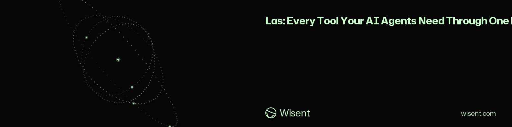
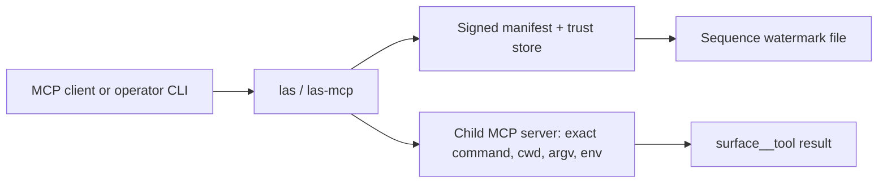

<!-- wisent-banner:start -->
<p align="center">
  
</p>
<!-- wisent-banner:end -->

<!-- wisent-readme-signals:start -->
[](https://github.com/wisent-ai/las) [](https://github.com/wisent-ai/las/issues) [](https://wisent.ai) [](https://discord.gg/qRjpkthq54) [](https://www.linkedin.com/company/wisent-ai/) [](https://x.com/wisentai) [](https://calendly.com/lbartoszcze)
<!-- wisent-readme-signals:end -->

# Las: Every Tool Your AI Agents Need Through One MCP

Access All Incredible Tools from Wisent and Explore Their Synergies.

Includes:

- Weles (Undetectable Browser for Perfect AI Agent Internet Use)
- Skarbiec (Secrets and Authentication Management for the AI Agent Era)
- Tama (Never Get Frustrated by AI Again — Block the Behaviors You Don’t Want)
- Stado (The Easiest Harness for Managing Compute and Storage Across Local, GCP, AWS, and Azure Infrastructure)
- Lem (The AI Research and Conference Management Tool That Fully Automates Research)
- Most (The Easiest Way to Add iMessage and SMS to Your AI Agent Stack)
- Probierz (AI QA That Makes Sure You Never Ship Anything Broken)
- Brama (Keep All Your Models Accessible Through One Endpoint)
- Echo (Growth and Content)
- Byk (Founder Strategy)
- Warsztat (Repository Proposal Workflow)
- Finance (Financial Reference and Proposals)

**Las is the local catalogue and policy-preserving federation layer for Wisent
agent tools: it discovers an operator-approved set of sibling MCP servers,
verifies their signed release contracts, and exposes them through one stdio MCP
server and one read-only CLI.**

Las does not implement the child tools, broaden their permissions, broker raw
secrets, or make an unavailable child look healthy. A child remains responsible
for its own authorization and product behavior.

[Quick start](#quick-start) · [Federated surfaces](#federated-surfaces) ·
[Signed release boundary](#signed-release-boundary) ·
[Canonical repository](https://github.com/wisent-ai/las)

Current boundary: public development source for Node.js 18+ under Apache-2.0.
Las expects a coordinated local Wisent workspace and operator-provisioned signed
release files. No stable package publication, hosted organization catalogue,
managed installation, or availability SLA is currently promised.

## Problem and intended users

A local coding agent can use multiple Wisent products—browser automation,
credential capabilities, compute status, research metadata, communications,
quality tooling, and proposal workflows—but registering every MCP server
individually creates collisions and inconsistent launch/security configuration.
Blindly aggregating whatever a child advertises would also turn local binary or
schema drift into an authority escalation.

Las serves:

- **local Wisent operators** who need one catalogue of configured agent surfaces;
- **coding-agent integrators** connecting a single stdio MCP endpoint instead of
  many sibling processes;
- **security and release operators** binding exact child commands, code/binary
  digests, environment names, tool names, schemas, and credential templates;
- **incident responders** checking which child starts, handshakes, and exposes the
  signed tool count without invoking its tools.

## Product boundaries

### Included

- `las` CLI for registry listing, advertised-tool inventory, and connectivity
  checks;
- `las-mcp` stdio JSON-RPC/MCP server;
- deterministic `<surface>__<tool>` namespacing;
- child process launch from a static repository-owned registry;
- Ed25519-verified, expiring, sequence-watermarked release manifests;
- exact binding of child command, working directory, argv, inherited environment
  names, binary digest, code digest, tool names, and input-schema digests;
- operator filters that can subtract surfaces through `LAS_ONLY` and `LAS_SKIP`;
- credential-template injection that model-supplied arguments cannot override;
- stricter local capability/output policy for the Skarbiec boundary;
- a separately configured proposal-only Finance boundary;
- cleanup of spawned children after stdin closes and in-flight requests settle.

### Explicit non-goals and limitations

- Las is not service discovery. The surface registry and workspace paths are
  compiled into source; there is no network registry or plugin auto-discovery.
- It does not install, build, configure, authenticate, or repair child products.
- It does not merge tool permissions. Routing through Las grants no permission
  beyond the signed/local policy and the child server's own checks.
- It is not a secret broker. Raw-secret environment inheritance is prohibited for
  ordinary signed surfaces; credential templates contain approved bounded values,
  not general secret discovery.
- It does not provide process isolation, sandboxing, network policy, resource
  quotas, or OS-user separation for children.
- A valid manifest proves authorization by a configured trust key and byte/schema
  binding. It does not prove that a child is safe, correct, bug-free, or free of
  malicious behavior.
- Federation tolerates an unavailable child by omitting its tools and logging only
  its static surface name. A partial catalogue is therefore possible.
- Child requests have no Las-imposed timeout. A child that never responds can
  keep the corresponding operation in flight until the process exits or is
  externally interrupted.
- The MCP server supports initialize, ping, tools/list, and tools/call—not the
  entire MCP protocol surface.
- The first federation result is memoized for one Las process; child changes are
  not hot-reloaded.
- Standalone clone layout is insufficient for normal use. Las resolves sibling
  products from the parent Wisent workspace.

## Federated surfaces

The current source registry knows these surfaces:

| Las name | Owning surface | Registry posture |
|---|---|---|
| `weles` | Weles browser executor MCP | signed release required |
| `skarbiec` | capability broker MCP | signed release plus strict local schema/taxonomy/result validation |
| `tama` | local hook catalogue/inspection MCP | signed release; explicit read-oriented tool allowlist |
| `stado` | compute status/cost/quota/schedule MCP | signed release required |
| `lem` | research registry/provenance MCP | signed release required |
| `echo` | growth/content dashboard MCP | signed release required |
| `most` | communications health/diagnostics MCP | signed release required |
| `probierz` | cross-platform quality MCP | signed release required |
| `byk` | founder-strategy/Oko MCP | signed release required |
| `brama` | model gateway detect/list MCP | signed release required |
| `warsztat` | repository proposal workflow MCP | signed release and explicit proposal-tool allowlist |
| `finance` | financial reference/proposal MCP | separate local policy and exact configuration required |

Descriptions are operator hints, not authorization contracts. The signed manifest,
local special policy, advertised schema verification, argument policy, and child
server enforcement determine the callable surface.

## Core use cases

### List the local catalogue

- **Actor:** a local operator.
- **Initial state:** Las can evaluate its signed release/configuration files.
- **Outcome:** JSON reports every known surface with static summary plus
  `configured` and `active` booleans.
- **Boundary:** `las list` does not spawn children or prove connectivity.

### Check child connectivity

- **Actor:** an operator diagnosing setup.
- **Initial state:** selected surfaces are active and their exact approved
  commands/builds exist.
- **Outcome:** Las spawns each child, initializes MCP, verifies `tools/list`,
  reports tool count, then closes it.
- **Boundary:** the check invokes no child tool and does not prove downstream
  credentials/data/providers are healthy.

### Expose one MCP endpoint

- **Actor:** a local coding agent with an approved identity/configuration.
- **Initial state:** an MCP client initializes Las, including the required agent ID
  when Skarbiec is active.
- **Outcome:** signed child tools appear as `surface__tool`; calls route to the
  owning child after policy-controlled argument injection/validation.
- **Boundary:** failures return generic Las errors; child-controlled diagnostics
  are intentionally not forwarded into the parent protocol stream.

## How it works

Las is a single local process with no service of its own. The CLI and the MCP
server share one static registry compiled into `src/registry.mjs`, resolve every
child from the parent Wisent workspace, admit a surface only when its signed
release entry verifies, then spawn that child's own MCP server over stdio and
proxy JSON-RPC to it. Tool names are namespaced on the way out; arguments and
results are policed on the way in and back. Las adds no capability of its own —
the child remains the authority for what it will do.



- **Durable state:** the sequence watermark named by
  `LAS_RELEASE_WATERMARK_FILE` is the only thing Las writes. It is advanced only
  to a higher manifest sequence, through an owner-only temporary file, `fsync`,
  and an atomic rename. The manifest, its detached signature, the trust store,
  and child policy files are operator-owned inputs that Las only reads.
  Everything else — the memoized federation result, spawned child handles, and
  pending requests — lives in memory for one Las process. Child product data
  stays with the child.
- **Credential boundary:** Las never inherits the parent environment. Each child
  receives a frozen environment built from a fixed system `PATH` plus only the
  variable names in that surface's allowlist, which must equal the signed
  `env_names` list. Names matching `TOKEN`, `SECRET`, `PASSWORD`, `UNLOCK`,
  `PRIVATE_KEY`, or `SIGNING_KEY` are rejected for ordinary surfaces. The trust
  store holds public verification keys only; no signing key belongs in this
  workspace. Signed credential templates are fixed arguments that model-supplied
  arguments cannot overwrite, and the Skarbiec boundary returns availability or
  opaque capability IDs rather than redeemed credentials.
- **Network boundary:** Las opens no sockets. Its only transports are the stdio
  line protocol with the calling client — one JSON-RPC request per stdin line,
  one response per stdout line — and one stdio pipe per child it spawns. Las
  always initiates the child connection; nothing connects inward. Any network
  traffic belongs to a child and to its own allowlisted configuration, such as
  `COMPUTE_API_URL` for `stado` or `MOST_BASE_URL` for `most`.
- **Failure boundary:** verification fails closed, per surface. A missing,
  invalid, expired, or rolled-back release, a binary/code digest or advertised
  schema mismatch, an argument or result policy rejection, or a child that will
  not start removes that surface from the catalogue and writes only its static
  registry name to Las stderr; child diagnostics are discarded and never enter
  the protocol stream. The remaining surfaces still federate, so a partial
  catalogue is a normal outcome and a missing tool must not be read as an empty
  healthy resource. A child that exits with requests outstanding rejects them,
  but Las imposes no timeout, so a child that never answers keeps that call in
  flight. When stdin closes, Las lets in-flight work flush and then closes every
  spawned child. Because federation is memoized for the process lifetime,
  recovery is a restart after the signed release or child build is repaired.

The [Architecture](#architecture) sketch below shows the same path in request
order.

## Architecture

```text
MCP client / local operator
          │
          ├─ las list|tools|check
          └─ stdio JSON-RPC -> las-mcp
                                │
                     active signed registry
                                │
          ┌─────────────────────┼──────────────────────┐
          ▼                     ▼                      ▼
   spawn child MCP       verify tools/schema      inject fixed
   exact cwd/argv/env     against manifest          templates
          │                     │                      │
          └─────────────────────┴──────────────────────┘
                                │
                        tools/call unchanged
                                │
              child authorization + product boundary
```

Las constructs child environments from a fixed system `PATH` and explicit
per-surface names. It does not inherit the complete parent environment.

## Quick start

### Prerequisites

- Node.js 18 or newer;
- a local Wisent workspace whose parent contains `las/` and the required sibling
  product repositories/build artifacts at registry-defined paths;
- current child binaries/modules;
- four absolute manifest/trust/watermark paths;
- owner-only trust-store and watermark files;
- a valid, unexpired, owner-signed release manifest and detached signature;
- child-specific configuration allowed by the registry.

```bash
git clone https://github.com/wisent-ai/las.git
cd las
npm install
```

`npm install` installs no runtime dependencies in the current package; Node core
modules implement the server. It does not populate sibling repositories or
release material.

Configure the signed release boundary:

```bash
export LAS_RELEASE_MANIFEST_FILE=/absolute/path/release-manifest.json
export LAS_RELEASE_MANIFEST_SIGNATURE_FILE=/absolute/path/release-manifest.sig.json
export LAS_RELEASE_TRUST_STORE_FILE=/absolute/path/trust-store.json
export LAS_RELEASE_WATERMARK_FILE=/absolute/path/watermark.json
```

Then inspect the registry without spawning children:

```bash
node src/cli.mjs list
```

Expected result: a JSON array containing each known surface, summary,
`configured`, and `active`. A missing/invalid manifest makes ordinary signed
surfaces unconfigured rather than silently trusting current files.

Check a selected subset:

```bash
LAS_ONLY=tama,brama node src/cli.mjs check tama brama
```

Expected result: per-surface JSON with `ok` and verified `toolCount`; exit `1` if
any selected child fails.

## Primary interfaces

### CLI

```text
las list
las tools [surface...]
las check [surface...]
```

When installed from an approved source, `package.json` exposes `las` and
`las-mcp`. Running source directly is equivalent:

```bash
node src/cli.mjs list
node src/cli.mjs tools tama brama
node src/cli.mjs check tama brama
node src/mcp.mjs
```

- `list` reads registry/configuration state only.
- `tools` spawns and handshakes selected children, returning namespaced tool
  names or a per-surface error object.
- `check` performs the same verified handshake and exits non-zero if any selected
  child is down.
- With no names, `tools`/`check` use every active surface after filters.
- Unknown, unsigned/unconfigured, or filtered-out explicit surfaces are rejected.

### MCP transport

Las reads one JSON-RPC request per stdin line and writes one response per stdout
line. Protocol version is `2024-11-05`.

Supported methods:

- `initialize` (exactly once);
- `ping`;
- `tools/list`;
- `tools/call`.

Notifications receive no response. Requests before initialization fail. A later
request may not replace `agentId`; when Skarbiec is active, initialization must
provide the exact `SKARBIEC_MCP_AGENT_ID`.

### Namespacing

A child tool `health` from surface `most` becomes:

```text
most__health
```

Las removes ambiguity with a double-underscore separator. The remote child still
receives its original `health` name.

### Operator filters

```bash
LAS_ONLY=tama,brama las list
LAS_SKIP=weles,finance las list
```

Both filters only subtract from eligible configured surfaces. They cannot add an
unsigned surface or bypass local configuration.

## Signed release boundary

Each ordinary surface entry binds:

- absolute command and working directory;
- exact argv and environment-variable names;
- SHA-256 of the launched binary and a designated code path;
- exact tool names;
- canonical SHA-256 of each advertised input schema;
- optional credential argument templates.

The detached Ed25519 signature covers the domain-separated raw manifest bytes.
The manifest uses strict JSON, positive sequence numbers, an RFC 3339 UTC expiry,
and unique surface/tool names. The trust store selects one configured public key.

The watermark rejects sequence rollback and is atomically advanced. Trust store
and watermark must be regular, current-user-owned files with no group/other
permissions. Manifest, signature, trust-store, and watermark variables must be
absolute paths.

At child launch Las additionally validates that:

- cwd and absolute code arguments remain inside the workspace;
- command is inside the workspace or is the exact current Node or
  `/usr/bin/python3` executable;
- binary/code digests equal the manifest;
- child `tools/list` exactly equals the signed names and schema digests;
- model arguments cannot overwrite signed credential templates.

Any mismatch fails closed for that surface.

## Special security boundaries

### Skarbiec

Las permits only `health`, `capability_available`, and `capability_request`, pins
their schemas/descriptions, validates a bounded purpose/resource/target taxonomy,
limits TTL to 60 seconds, use count to one, and delegation depth to zero, and
validates exact result envelopes. It returns only availability or opaque
capability IDs—not redeemed credentials.

### Finance

Finance is not admitted through the ordinary signed-manifest map. It activates
only when all finance policy/state/key/binary-digest variables are set, verifies
the exact binary digest and a local proposal-only policy fingerprint, and permits
only `finance_propose`, `finance_status`, and `finance_cancel`. Names containing
execution/approval/signing/broadcast/beneficiary/policy verbs are rejected.

This is still a local guard; the child must enforce its own proposal-only and
financial authorization boundary.

## Security and privacy

- Protect trust-store private provenance, watermark state, signed manifest,
  policy files, and Skarbiec/Finance configuration from unauthorized changes.
- Las uses public verification keys, not signing keys. Never place a manifest
  private signing key in this workspace or child environment.
- Ordinary child environments reject raw-secret variable names. Use Skarbiec or
  child-owned secure transport rather than broad environment inheritance.
- Credential templates are operator-signed fixed arguments. Review them as
  authority-bearing release content even when they are opaque identifiers.
- Child tool results can contain sensitive customer or operational data. Las does
  not redact ordinary child results; the client and child policies remain
  responsible.
- Child stderr is discarded by Las. Operate child-specific logs separately when
  diagnostics are required.
- Partial federation is allowed. Clients must not interpret a missing tool as an
  empty/healthy downstream resource.
- The child process runs under the Las OS account. Use OS sandboxing and least
  privilege where the product risk requires stronger isolation.
- Never attach manifests, policy/state files, capability IDs, customer tool
  results, agent identities, or private paths to a public issue.

## Operational model

- **Configuration:** static source registry, signed release files, trust store,
  watermark, operator filters, and explicitly allowed child variables.
- **State:** in-memory memoized federation, child processes, pending requests, and
  persistent sequence watermark.
- **Credentials:** Las holds no general secret store; signed templates and
  child-specific secure boundaries carry approved authority.
- **Observability:** CLI JSON, generic per-surface stderr availability/failure
  lines, child-owned logs, and MCP errors.
- **Failure model:** invalid/expired/rolled-back release, byte/schema drift,
  missing build/configuration, child exit/error, or policy rejection fails the
  affected surface. Federation can remain partially available.
- **Recovery:** deploy a new signed higher-sequence release, repair exact child
  builds/configuration, restart Las, and repeat `las check` for the affected
  surface.
- **Cost:** local processes and child service usage; managed organization
  catalogue/governance is a separate platform surface.

## Open and managed boundary

The local catalogue and tool federation are the community surface
(`las.local`). A future managed platform may sell organization catalogue,
release/governance distribution, and fleet operation under
`platform.organization-catalogue`.

A missing managed grant must fail closed only for that organization catalogue; it
must not disable the local catalogue and federation. Las is bundled with the
parent product rather than independently metered in the current entitlement
contract.

## Project status and support

- **Maturity:** public development source; coordinated workspace/release
  provisioning required.
- **Distribution:** source package with CLI/MCP bin declarations; no stable public
  registry package or supported binary release is promised.
- **Compatibility:** Node.js 18+, macOS/Linux-style local workspace paths as
  encoded by the child registry, and stdio MCP `2024-11-05`.
- **Issues:** [`wisent-ai/las`](https://github.com/wisent-ai/las/issues).
- **Security:** use private GitHub Security Advisories; do not include signed
  release material, internal paths, policy files, agent/capability identifiers,
  child outputs, or credentials in public reports.
- **License:** Apache License 2.0; see [`LICENSE`](LICENSE).